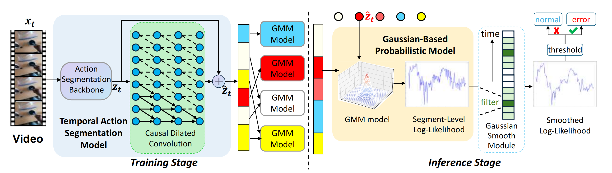
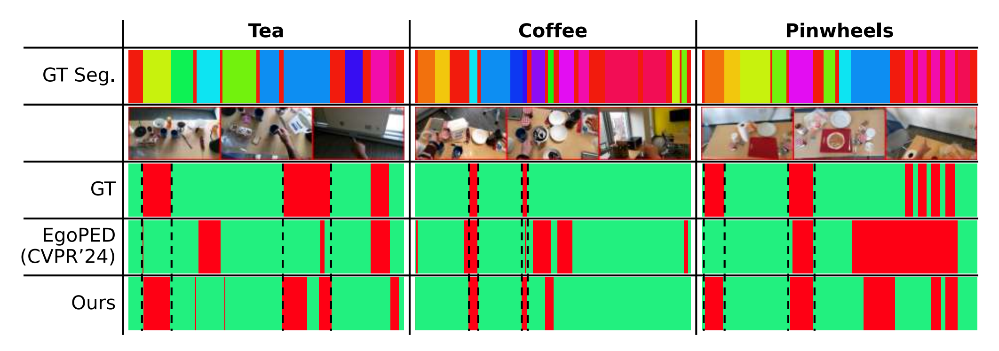

# PECC-for-Error-Detection-in-Egocentric-Videos

[Introduction](#Introduction)  
[Results](#Results)  
[Experiment](#Experiment)   

This is the source code of "Probabilistic Embeddings with Causal Constraint for Error Detection in Egocentric Procedural Videos" as described in the paper [Probabilistic Embeddings with Causal Constraint for Error Detection in Egocentric Procedural Videos](ICME_2025_PECC.pdf).

## Introduction

Our overall framework of the proposed **Probabilistic Embeddings with Causal Constraint (PECC)** method consists of two key components: **Causal Dilated Convolution (CDC)**, which integrates causal constraints into the temporal action segmentation model, and **Gaussian-Based Probabilistic Modeling (GBP)**, which utilizes Gaussian Mixture Models (GMMs) for modeling normal actions to improve error detection in egocentric procedural videos.





## Results
Our method achieves state-of-the-art (SOTA) results on both the EgoPER and HoloAssist datasets.

Comparison with previous methods on the EgoPER dataset:  


Comparison with previous methods on the HoloAssist dataset:  
<p align="center">
  
</p>

Visualization of our method compared to the EgoPED method from the CVPR 2024 paper on a specific use case:  


## Experiment

### Environment

This codebase has been developed and validated under the following environment:
- **OS:** Ubuntu 20.04.5 LTS
- **Python:** 3.8
- **PyTorch:** 1.13.1
- **CUDA:** 11.7
- **GPU:** 48GB NVIDIA A6000

#### Setup

To set up the environment, please follow these steps:

```bash
conda create -n pecc python=3.8
conda activate pecc
pip install torch==1.13.1+cu117 torchvision==0.14.1+cu117 torchaudio==0.13.1 --extra-index-url https://download.pytorch.org/whl/cu117
pip install -r requirements.txt
```

For Non-Maximum Suppression (NMS) Library, please refer to the guidance provided in the ActionFormer documentation, which can be found here: [ActionFormer Installation Guide](https://github.com/happyharrycn/actionformer_release/blob/main/INSTALL.md).


### Data
This experiment utilizes two datasets: **EgoPER** and **HoloAssist**. You have the option to either use the pre-extracted feature files provided by us (available via a Google Drive link) or extract features yourself using the original data processing methods described below.
#### Pre-Extracted Features
We provide 10FPS extracted features for both the **EgoPER** and **HoloAssist** datasets, using the data preprocessing pipeline described in the [EgoPER Official Repository](https://github.com/robert80203/EgoPER_official). Specifically, the raw video data was resampled to 10 frames per second (10FPS), and the features were extracted using the I3D model. Additionally, for the **EgoPER** dataset, we have included **Active Object Detection (AOD) information**, which is processed alongside RGB features as input to the model. 
The dataset weights for EgoPER can be found at this [Google Drive link](https://drive.google.com/drive/folders/1cLPQB0keDmM25Imb3Et0fUjBlbPnCfyE?usp=sharing).
For HoloAssist, due to the large size of the dataset, we only provide the annotation and split files.

#### Dataset File Structure
The dataset files should be organized as follows:

data/         
│
├── EgoPER/        
│
└── HoloAssist/     

Please ensure that the above structure is followed for proper data processing and analysis.
#### Original Data Processing
To process the raw datasets into 10FPS features:
- For **EgoPER**, refer to the [EgoPER Official Repository](https://github.com/robert80203/EgoPER_official) for both dataset access and detailed instructions.
- For **HoloAssist**, visit the [HoloAssist Official Website](https://holoassist.github.io/) for dataset access and related documentation.


### Training
for EgoPER 
```bash
bash ./tools/EgoPER/run_train.sh
```

for HoloAssist
```bash
bash ./tools/EgoPER/run_train.sh
```

### Inference
for EgoPER 
```bash
bash ./tools/EgoPER/run_test.sh
```

for HoloAssist
```bash
bash ./tools/EgoPER/run_test.sh
```

